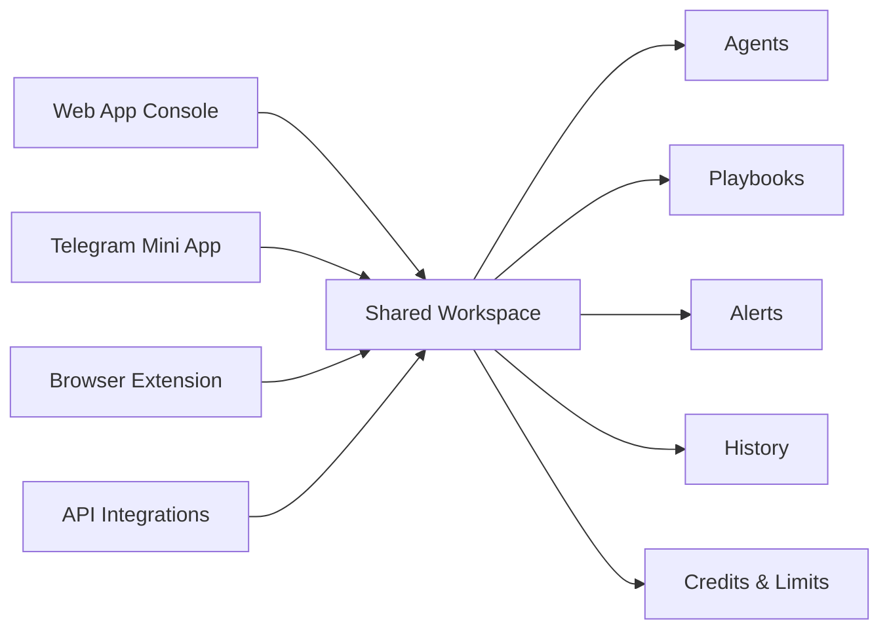

# Corelytix

**On-chain and market intelligence workspace for traders, desks, and funds**

  <a href="#core-idea">Core Idea</a>
  ·
  <a href="#your-capabilities">Your Capabilities</a>
  ·
  <a href="#real-use-cases">Real Use Cases</a>
  ·
  <a href="#system-features">System Features</a>
  ·
  <a href="#product-view">Product View</a>
  ·
  <a href="#start-flow">Start Flow</a>
  ·
  <a href="#common-questions">Common Questions</a>

### Quick Links

---

## Core Idea

Corelytix is a workspace for on-chain and market intelligence that helps traders, desks, and funds turn raw crypto data into concrete, repeatable decisions across the Web App, Telegram Mini App, Browser Extension, and API.

> [!IMPORTANT]
> Corelytix is a signal, context, and automation layer — not a DEX, not a custodian, and not a trade execution venue

Instead of forcing research into disconnected tools, Corelytix gives you one workspace where wallets, tokens, watchlists, agents, Playbooks, alerts, history, and API access live together.

> [!TIP]
> Configure once in the Web App, then trigger the same logic from Telegram, the browser extension, or your own systems through the API

---

## Your Capabilities

This is what you can actually do with Corelytix

| Action | What you get |
|---|---|
| Analyze tokens | Price context, holder structure, liquidity context, flows, and risk flags |
| Profile wallets | Portfolio view, PnL windows, behavior labels, counterparties, and suspicious flow signals |
| Monitor narratives | Track live market context and combine it with wallet and token intelligence |
| Run agents | Turn repeatable research tasks into one-click or automated workflows |
| Build Playbooks | Chain multiple steps into scheduled or reusable research routines |
| Receive alerts | Push selected price, risk, and flow events into Telegram or other channels |
| Use inline context | Open token and wallet intelligence directly while browsing DEXes, explorers, X, and news |
| Integrate via API | Plug Corelytix logic into bots, dashboards, desk tooling, and internal automations |

> [!NOTE]
> All heavy actions are tracked through a shared credit model, while light actions like switching views or reopening saved results stay lightweight inside the interface

---

## Real Use Cases

### 1) Fast token due diligence
You spot a token in a feed, on a DEX, or inside an explorer. Corelytix lets you move from a raw address to a structured token view with price context, holder distribution, flow behavior, and risk markers.

> [!WARNING]
> Quick visibility is not the same as certainty — analytics reduce blind spots, but they do not remove market risk, execution risk, or narrative volatility

### 2) Wallet intelligence before following smart money
Before mirroring a wallet, you can inspect behavior patterns, counterparties, concentration, performance windows, and suspicious activity instead of reacting to a single screenshot or social post.

### 3) Daily desk workflows
Use Playbooks to run the same market and risk routine every day: market snapshot, wallet scans, token checks, and a formatted summary delivered to Telegram.

### 4) Context while browsing
The browser extension adds inline intelligence where you already work. Instead of copying addresses into separate tabs, you can open context directly on the page and escalate into a deeper report when needed.

### 5) API-driven automation
Use workspace-scoped API keys to trigger agents, poll jobs, sync configs, and push Corelytix outputs into internal systems without rebuilding the research stack from scratch.

---

## System Features

Corelytix is action-first on the surface, but these system layers are what make the workflow possible

### Workspace model
- One workspace per team, desk, or strategy
- Shared agents, Playbooks, alerts, history, credits, and plan
- User-level preferences stay personal, while reporting defaults stay workspace-level

### Wallet-based account model
- Sign in by signing a one-time wallet challenge
- No passwords, no email login, no seed phrase sharing
- The same wallet identity works across Web App, Telegram Mini App, Browser Extension, and workspace API access

> [!CAUTION]
> Signing in proves wallet ownership only. It does not submit a transaction, spend funds, approve token allowances, or expose private keys

### Shared surfaces

| Surface | Main role |
|---|---|
| Web App | Full control plane for workspaces, agents, Playbooks, alerts, history, settings, and API keys |
| Telegram Mini App | Fast checks, lightweight runs, alert delivery, and digest consumption |
| Browser Extension | Inline token and wallet context while browsing DEXes, explorers, X, and news |
| API | Programmatic access for bots, dashboards, CI, desk tooling, and automations |

### Credits, limits, and predictability
- Credits are the common unit of heavy work across UI and API
- Plans define monthly capacity and unlocked limits
- Clear caps exist for rate limits, concurrency, and daily heavy usage
- Failed jobs caused by platform-side errors are not meant to silently burn user value

### Agents and Playbooks
- Agents handle repeatable research tasks such as wallet risk, token due diligence, or market overview
- Playbooks combine multiple steps into reusable and scheduled workflows
- Config can live in the UI first, then move into JSON or YAML for version-controlled workflows

### API architecture
- Workspace-scoped and key-based
- Separate Dev, Staging, and Prod environments
- Versioned endpoints such as `/v1/...`
- Credit usage and request metadata returned in a consistent response envelope

---

## Product View

Corelytix is one workspace with multiple surfaces around it

### What the product view should feel like

| Area | What the user should see |
|---|---|
| Token analysis | Market context, structure, risk markers, and deeper drill-down paths |
| Wallet analysis | Portfolio summary, PnL windows, behavior view, counterparties, and labels |
| Agent runs | Clear entry point, parameter selection, job status, and final result block |
| Playbooks | Scheduled logic, step chain visibility, and output destinations |
| Alerts | Signal rules, Telegram destinations, and digest controls |
| API / Integrations | Keys, scopes, environments, usage, and config sync readiness |

> [!IMPORTANT]
> Because all surfaces connect to the same workspace, users should experience continuity rather than separate products stitched together

### Screenshot placeholders
- Console dashboard
- Token analysis view
- Wallet deep-dive view
- Agent run modal or job status screen
- Telegram Mini App alert or digest preview
- Browser extension inline panel

---

## Start Flow

Getting started should be simple and practical

### Step-by-step

1. Open the **Web App**
2. **Sign in with wallet** and enter or create your workspace
3. Set your **timezone**, **base currency**, and basic workspace preferences
4. Add the first **wallets** and **tokens** to watchlists
5. Configure at least one **starter agent** and one **daily Playbook**
6. Link the **Telegram Mini App** for alerts and quick runs
7. Install the **Browser Extension** for inline context while browsing
8. Create an **API key** if you want bots, automations, or dashboards to use the same workspace logic

> [!TIP]
> The best first workflow is simple: connect wallet → create workspace → add watchlists → run a wallet scan → link Telegram → install extension

### Example first actions

| First move | Why it matters |
|---|---|
| Run a wallet risk scan | Fastest way to feel the value of structured intelligence |
| Analyze one token deeply | Turns raw market curiosity into a reusable research artifact |
| Create a daily desk report | Makes the platform useful even when you are not actively clicking |
| Open the extension on a live page | Shows how Corelytix reduces context switching |

---

## Common Questions

### What is Corelytix actually built for
Corelytix is built for turning raw on-chain and market data into repeatable research, monitoring, and decision workflows

### Is Corelytix a trading platform
No. It provides signal, context, and automation. Real execution stays with your wallet, exchange, or aggregator

### Do all surfaces use the same account and credits
Yes. The Web App, Telegram Mini App, Browser Extension, and API all connect to the same workspace model, shared history, and shared credit pool

### How does sign-in work
You sign a one-time challenge with your wallet. This proves control of the address without creating a password-based account or sending an on-chain transaction

### What consumes credits
Heavy actions such as deep analytics, agent runs, Playbook executions, and similar compute-intensive workflows. Light interface actions do not meaningfully consume credits

### Can teams use it together
Yes. Workspaces are designed for team or strategy-level collaboration with shared assets, shared limits, and visible run history

### Can I integrate it into my own systems
Yes. Corelytix exposes a workspace-scoped API with environment separation, scoped keys, and support for config-as-code workflows

### Is it safe to connect my wallet
Corelytix uses wallet-based authentication for identity. Signing in does not approve tokens, move assets, or reveal private keys

> [!WARNING]
> Never submit seed phrases, raw credentials, card details, or other highly sensitive secrets into the platform or API

---

## Additional Product Notes

> [!NOTE]
> Corelytix supports privacy-by-default handling, environment separation, versioned APIs, job-level metadata, and config-driven workflows for agents and Playbooks

> [!IMPORTANT]
> For production use, API keys should be environment-specific and stored in a secret manager rather than inside repositories or client-side code

---

## Risk Notice

Corelytix is an intelligence and workflow platform. It helps structure data, surface signals, and automate research, but it does not guarantee market outcomes, remove execution risk, or replace independent judgment.

> [!CAUTION]
> Crypto markets are volatile, wallet behavior can be misleading, narratives can shift fast, and any action based on analytics still carries real financial risk

Use Corelytix as a decision support layer, not as a promise of profit.
